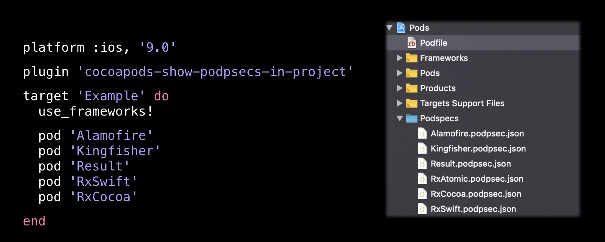

# cocoapods-show-podpsecs-in-project

A CocoaPods plugin which shows all project related podpsecs in pods project, including all dependencies. 

No need to lookup podspecs any more.

## Installation

    $ gem install cocoapods-show-podpsecs-in-project

## Usage

    plugin 'cocoapods-show-podpsecs-in-project'

Add this line to `Podfile`, and you are all set 🥳

After a `pod install`, all podspecs should be shown in pods project.

## License

MIT
